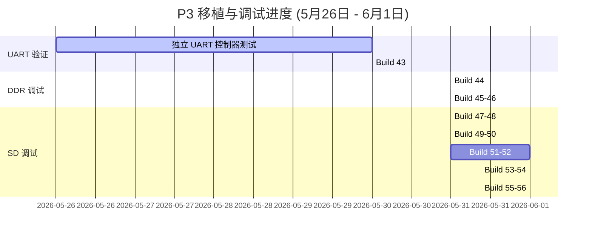

# 调试总结与技术汇报文档：HuaPro P3 (Versal) 平台移植进展 (5月26日 - 6月1日)

本报告汇总了从 **5月26日（上周二）至 6月1日（本周一）** 期间，在 **HuaPro P3 (Versal VP1902)** 开发板上移植 **OpenPiton + Ariane (CVA6 64-bit RISC-V)** 平台所进行的所有硬件调试、故障诊断以及方案收敛过程，为周末的进度汇报提供支撑。

---

## 一、 整体移植与调试里程碑 (时间线总览)

在本时间段内，我们通过 **“UART 独立验证” -> “DDR 读写折叠” -> “Bootrom 调通” -> “SD 控制器复位释放” -> “CMD55 超时与线序排查”** 这一递进式调试流程，解决了数个系统级总线死锁问题。



---

## 二、 调试细节与 Build 演进记录

### 1. 独立 UART 验证与 Build 43 (5月26日 - 5月30日)
* **工作内容**：在移植初期，我们需要在隔离状态下验证 P3 的物理引脚连通性（`CW58/CW59`）与 Xilinx AXI 16550 UART 的访问可行性。
* **Build 43 实施**：使用纯 RV64 汇编构建了不含 DDR 访问的最小化测试镜像（免去运行栈），控制 CPU 周期性读取串口并发射 `A`。
* **调试结果**：串口终端成功收到了连续的 `A`，且 ILA 解码正确。这证实了 **CPU 取指路径、OpenPiton UART NoC 桥、物理串口链路完全畅通**，确立了健康的调试基准。

### 2. DDR4 NoC 地址折叠调试 (Build 44 - Build 46) (5月31日)
* **Build 44 (DDR 读通道挂起)**：引入单次读写探测。ILA 显示写通道（AW/W/B）握手成功并返回 OKAY，但读通道（R）由于某种原因超时挂起，导致核心卡死。
* **Build 45 (BD地址更改尝试)**：怀疑是 CPU 发出的物理地址 `0x84000000` 与 BD 中 DDR 映射基址 `0x00000000` 冲突。尝试在 BD 内部直接将基址改为 `0x80000000`，但因为 Versal NoC 接入 `S_AXI_MEM` 必须映射在 2GB 空间内，BD 编译报错拒绝生成。
* **Build 46 (RTL级地址翻译)**：在顶层 [p3_top.v](file:///L:/home/illya/openpiton/piton/design/xilinx/huaprop3/p3_top.v) 中引入 `P3_AXI_DDR_ADDR_TRANSLATE`。在 CPU 的 DDR 请求送进 BD 之前，硬件自动扣除高位偏移量（重定向到 `0x00000000` 空间）。
* **调试结果**：DDR 读通道瞬间被激活，返回正确的读数据。DDR4 访问完全调通。

### 3. Bootrom 搭载与 SD 拷贝挂死 (Build 47 - Build 48) (5月31日)
* **Build 47 (正常 Bootrom 搭载)**：进入正常的 C Bootrom。系统顺利执行并成功在串口打印出了完整的 `OpenPiton+Ariane Platform` Banner。但在随后的阶段没有后续输出。
* **Build 48 (定位挂起点)**：引入总线监测 ILA。解码发现 CPU 被永久阻塞在 Bootrom 内的 `sd_copy+0xcc`（即从 SD 卡读取 GPT 分区并拷贝 Payload 镜像的循环）。
* **分析**：由于 SD 模块未完成硬件初始化（`init_done = 0`），SD 控制器的 Ready 信号 `sd_buf_noc2_ready` 恒定为 `0`，使得 CPU 对 SD 卡空间的 AXI 读请求被总线永久挂起。

### 4. SD 控制器硬复位释放 (Build 49 - Build 52) (5月31日 - 6月1日)
* **Build 49 - 50 (SD-smoke 读测试)**：绕过 GPT 复制机制，使用无运行栈的汇编直接读取 SD 空间的 LBA0。Ready 信号依然为 0，证实卡死发生在 SD 桥接/控制器硬件层，而非软件运行栈。
* **Build 51 (内部状态暴露)**：在 ILA 中引出 SD 初始化 FSM 和控制信号。惊奇地发现 **卡检测信号 `sd_cd = 1` 导致了复位死锁**。根据 RTL 定义：`rst = sys_rst | sd_cd`（且 `sd_cd` 为低电平有效）。板卡反馈 `sd_cd=1` 误报“无卡插入”，使整个 SD 模块被永久锁在硬复位中，无法产生时钟与 Wishbone 响应。
* **Build 52 (屏蔽 CD 复位)**：通过 `P3_SD_IGNORE_CARD_DETECT_RESET` 屏蔽了卡检测对复位的影响。ILA 捕获显示：**Wishbone ack 开始响应，SD clk 时钟开始输出，硬复位成功释放。**

### 5. CMD55 无限超时与线序交叉探究 (Build 53 - Build 54) (6月1日)
* **Build 53 (CMD探针导入)**：复位释放后依然不通。引入命令层 ILA 探针，捕获解码得到总线状态为 `0x34ccdc004e204404`：
  * 初始化 FSM 处于 `0x34` (`ST_ACMD41_CMD55_WAIT_INT`)，且串行主机处于 `READ_WAIT` 状态。
  * **故障机制**：控制器已成功发射 `CMD55`，但因为 SD 卡没有在 CMD 线上拉低响应起始位（Start Bit），控制器等待超时（20000周期），随后不断重发 `CMD55` 陷入死循环。
* **Build 54 (上拉实验)**：在约束中对 `sd_cmd`、`sd_dat[3:0]` 引入 `PULLUP` 弱上拉，但依然卡死在同一状态，排除了单纯信号浮空问题。

---

## 三、 核心突破：SPI 模式引脚交叉错位 (SPI Wire-Crossing) 假说

在对 UART 成功通车（引脚为 `CW58/CW59`）进行反向推导时，发现它们与 `p3_io.md` 官方声称的引脚（`CM59/CN59`）不同。这意味着不能盲目套用手册引脚，物理开发板的连线确实是按照参考工程 `shell.xdc` 的引脚（`CV57`, `DB57` 等）来布线的。

那么为什么 SD 依然不响应？因为**参考工程设计时使用的是 SPI 模式驱动 SD 卡**。这造成了 Native 模式下的管脚交叉对调：

```
[OpenPiton 控制器逻辑]                         [物理 SD 卡卡座引脚]
sd_cmd    (DB57)  =======（物理连线）=======>  Pin 1 (DAT3/CS)  [卡端用于传输数据/片选]
sd_dat[3] (CY55)  =======（物理连线）=======>  Pin 2 (CMD/DI)   [卡端用于接收命令]
```

* **后果**：Native 模式下，控制器的命令从 `DB57` 发送，在物理上被送到了卡的 `DAT3` 引脚。而卡真正接收命令的 `CMD` 引脚（连接到 `CY55`）却只接收到了空闲的数据线高电平。SD 卡因此保持完全静默。

---

## 四、 下周实验设计 (Build 55 - Build 56)

1. **Build 55 (进行中)**：继续进行原计划的时钟路径优化实验（引入 IOB 寄存器驱动 `sd_clk_out`）。
2. **Build 56 (物理引脚对调与对照实验)**：
   * **实验 56A (验证引脚交叉对调)**：在 XDC 中对调 `sd_cmd` 和 `sd_dat[3]` 的引脚：
     ```xdc
     set_property PACKAGE_PIN CY55 [get_ports sd_cmd]
     set_property PACKAGE_PIN DB57 [get_ports {sd_dat[3]}]
     ```
     如果烧录后 ILA 的 `READ_WAIT` 状态消失并获得响应，说明“SPI 交叉错位”假说成立，硬件将彻底调通。
   * **实验 56B (验证官方引脚)**：作为对照，制作完全基于 `p3_io.md` 描述的 PHC3 原生引脚映射版本，用于横向排查。
