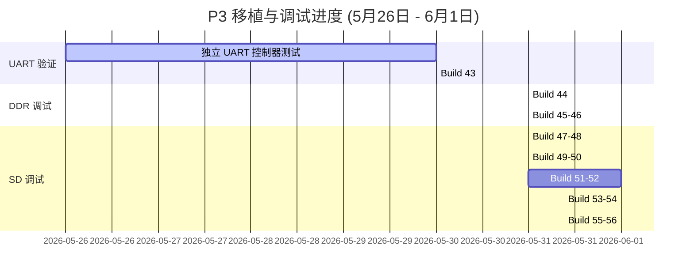

# 调试总结与技术汇报文档：HuaPro P3 (Versal) 平台移植进展 (5月26日 - 6月1日)

本报告汇总了从 **5月26日（上周二）至 6月1日（本周一）** 期间，在 **HuaPro P3 (Versal VP1902)** 开发板上移植 **OpenPiton + Ariane (CVA6 64-bit RISC-V)** 平台所进行的所有硬件调试、总线故障分析、协议与连线诊断以及解决方案。本周我们成功解决了系统级总线死锁、DDR NoC 映射冲突、控制器复位锁死等关键问题，并收敛得到了目前的物理链路故障假说。

---

## 一、 整体移植与调试里程碑 (时间线总览)

本周我们通过 **“UART 独立验证” -> “DDR4 读写折叠” -> “Bootrom 调通” -> “SD 控制器复位释放” -> “CMD55 超时与线序交叉排查”** 这一递进式调试流程，解决了数个系统级总线死锁问题。



---

## 二、 各 Build 设计初衷、验证结果与结论汇总

### 1. Build 43 (5月30日)
* **设计初衷与目标假设**：
  在前期启动中，由于直接烧录完整 BBL 引导镜像时串口没有任何输出，无法判断是 CPU 未正常工作、串口引脚错误还是内存控制冲突所致。
  * **假设**：CPU 取指路径与外设 NoC 桥的基本控制逻辑是完好的。
  * **设计**：编写纯 RV64 汇编测试镜像（`startup_asm_uart16550.S`），完全排除 C 语言运行栈和 DDR 参与，通过 AXI-Lite 空间直接向 ns16550 写入数据，轮询 LSR[5] 状态，成功后发射字符 `A`。
* **硬件验证结果与结论**：
  * **结果**：串口成功接收到不间断的 `A`；ILA 解码显示 UART 读写事务正常，B 通道返回 OKAY。
  * **结论**：**Ariane 核心的取指译码、外设 NoC 桥、AXI-Lite 适配层及物理串口连接通路（CW58/CW59）完全正常**。问题被锁定在 DDR4 控制器或软件系统。

### 2. Build 44 (5月31日)
* **设计初衷与目标假设**：
  测试 CPU 读写 DDR4 的能力，验证 Versal 板载 DDR4 SODIMM 链路的可用性。
  * **假设**：内存控制器（MIG）和物理 DDR4 能够正常进行单次 store/load 访问。
  * **设计**：编写纯汇编测试镜像，在内存物理地址 `0x84000000` 执行单次存取与比较（`store-fence-load`），并在顶层加入 `P3_BD_DDR_DEBUG_ILA` 探针包，实时抓取 AXI 写与读通道的所有握手及状态。
* **硬件验证结果与结论**：
  * **结果**：ILA 观察到写通道（AW/W/B）全部完成并返回 OKAY，但读通道（AR）发起请求后，RVALID 始终为 `0`，CPU 读挂死。
  * **结论**：**DDR4 控制器的写通路在物理上已通，但读通道受阻，发生了总线级读挂起故障**。

### 3. Build 45 (5月31日)
* **设计初衷与目标假设**：
  探索 DDR 读挂起是否是由 CPU 发出的地址与控制器物理段映射冲突引起。
  * **假设**：在 Block Design (BD) 内将 NoC DDR 基地址直接从默认的 `0x00000000` 改为与 CPU 地址一致的 `0x80000000`，可以实现直通读写。
  * **设计**：在 BD 内部通过脚本参数强行设定 `P3_DDR_AXI_OFFSET = 0x80000000` 并重建项目。
* **硬件验证结果与结论**：
  * **结果**：Vivado 在 BD 地址段验证时报错中断，无法通过设计法则检查（DRC）。
  * **结论**：**Versal NoC 对 S_AXI_MEM 的硬核译码存在物理限制，只允许映射在 LOW0 空间即 2GB 以内（基准 0x0）**。在 BD 层直接移位基址的方案宣告失败。

### 4. Build 46 (5月31日)
* **设计初衷与目标假设**：
  寻找能同时妥协 CPU 和 NoC 硬件地址布局的解决方案。
  * **假设**：在顶层 Verilog 中对 AXI 物理请求进行地址“折叠”——将 CPU 的 `0x80000000..0xffffffff` 地址在顶层扣除 `0x80000000` 偏移量后再送交 BD，既能支持 CPU 汇编中的常规内存编址，又能满足 NoC 对 LOW0 空间的硬性物理限制。
  * **设计**：在 `p3_top.v` 中引入 `P3_AXI_DDR_ADDR_TRANSLATE` 翻译模块：
    ```verilog
    assign bd_m_axi_awaddr = m_axi_awaddr - 64'h80000000;
    assign bd_m_axi_araddr = m_axi_araddr - 64'h80000000;
    ```
* **硬件验证结果与结论**：
  * **结果**：重新烧录后，DDR AXI 读通道（R）顺利握手，且串口打印出持续的 `A`，未发生读卡死。
  * **结论**：**顶层地址折叠方案完全成功，DDR4 的读写功能彻底通畅**。

### 5. Build 47 & Build 48 (5月31日)
* **设计初衷与目标假设**：
  将 DDR 地址折叠带入正式的引导流程中。
  * **假设**：DDR 稳定后，全功能 C 语言 Bootrom 可正常执行引导程序，从 SD 卡读取 GPT 分区并开始拷贝 payload。
  * **设计**：重新编译搭载 C 运行栈的正常 Bootrom，并通过 `p3_dbg_core_bus64_i_1` 实时捕获 CPU 的取指（PC）地址（**Build 48**）。
* **硬件验证结果与结论**：
  * **结果**：串口成功打印出 `OpenPiton+Ariane Platform` 的 Banner，随后系统卡死。ILA 解码显示 CPU 永久处于取指地址 `0xfff101057c`。该地址在反汇编中对应 `sd_copy+0xcc`（块拷贝循环尾的 `bne`）。
  * **结论**：**DDR 物理读写与软件运行栈完全正常。但系统在读取 SD 控制器缓冲区时发生死锁**。核心 ready 信号 `sd_buf_noc2_ready` 恒为 0，对 CPU 总线产生强压，引发总线读挂死。

### 6. Build 49 & Build 50 (5月31日)
* **设计初衷与目标假设**：
  排除软件和文件系统层面对硬件的干扰。
  * **假设**：死锁可能由于 BBL 镜像损坏或 GPT 算法进入死循环引起，排除 C 语言运行栈对硬件状态机的影响，直接验证 SD 物理读链路。
  * **设计**：编写 direct SD 读汇编镜像（`sd_smoke`），跳过 GPT 解析与分区拷贝，控制 CPU 直接对 SD 空间的 LBA0 地址执行 AXI 读操作。
* **硬件验证结果与结论**：
  * **结果**：系统在发射 SD 读 valid=1 后，ready 信号依然为 0 引起死锁。
  * **结论**：**死锁原因彻底被隔离并定位在 SD 桥接/控制器内部硬件层面**，与软件栈或 SD 卡镜像内容无关。

### 7. Build 51 (5月31日)
* **设计初衷与目标假设**：
  找出 SD 卡控制器不给出 Ready 信号的硬件根源。
  * **假设**：SD 卡控制器的初始化状态机（FSM）或总线控制信号被内部某些状态拉死。
  * **设计**：设计调试总线，将初始化状态机 FSM（8位）和时钟/控制标志连入 ILA 以暴露内部微观运行状态。
* **硬件验证结果与结论**：
  * **结果**：ILA 成功解码，暴露出卡检测信号 `sd_cd` 恒定为高电平 `1`。
  * **结论**：开发板卡检测为低有效，`sd_cd = 1` 意味着误报“无卡插入”。根据 RTL 复位定义 `rst = sys_rst | sd_cd`，这导致 **整个 SD 模块被物理性地强制锁定在硬复位中，状态机根本不工作**。

### 8. Build 52 (6月1日)
* **设计初衷与目标假设**：
  解除卡检测信号对内部硬件复位的误锁定。
  * **假设**：屏蔽卡检测复位后，初始化状态机可正常流转并拉高 `init_done`，进而释放 Ready 信号。
  * **设计**：在 `piton_sd_top.v` 中引入 `P3_SD_IGNORE_CARD_DETECT_RESET` 屏蔽宏，将 CD 信号从复位逻辑中剥离，仅供 ILA 查看。
* **硬件验证结果与结论**：
  * **结果**：SD 模块硬复位成功释放。Wishbone 总线 ack 开始频繁交互，SD 时钟（SD CLK）成功输出。但初始化仍未收敛，最终稳定在 FSM 状态 `0x34` (`ST_ACMD41_CMD55_WAIT_INT`)。
  * **结论**：**硬复位解锁成功，控制器能够与卡通信，但卡死故障下移至命令应答边界**。

### 9. Build 53 (6月1日)
* **设计初衷与目标假设**：
  探究状态机为何卡在发送命令 `CMD55` 的完成中断（`0x34`）上。
  * **假设**：通过在命令和串行收发层上增设细粒度探针（`P3_BD_SD_CMD_DEBUG_ILA`），监测看门狗、命令索引、串行及命令控制器的交互。
  * **设计**：在 `sdc_controller.v` 中引出 56 位命令主机总线并烧录捕获。
* **硬件验证结果与结论**：
  * **结果**：ILA csv 数据解码为 `0x34ccdc004e204404`。串行主机停在 `READ_WAIT`（0x08），看门狗在不断累加，`sd_cmd_dat_i = 1`。一旦看门狗到 20000，触发超时错误（`CTE`），FSM 便清除错误并重新发送 `CMD55`。
  * **结论**：**控制器已发射 CMD55，但物理 SD 卡对命令完全没有响应**，导致控制器处于无限超时重试的死循环中。

### 10. Build 54 (6月1日)
* **设计初衷与目标假设**：
  排除由于物理总线引脚电平悬空或高阻态引起的信号干扰。
  * **假设**：在 Native 模式探测时，若 DAT3/CS 信号浮空，SD 卡可能会误进入 SPI 模式，从而导致后续不响应 Native 模式下的 `CMD55` 指令。
  * **设计**：在 constraints.xdc 中加入弱上拉约束（`PULLUP`），将 `sd_cmd`、`sd_dat[3:0]` 置为稳定偏置。
* **硬件验证结果与结论**：
  * **结果**：死锁状态与解码数据未发生变化。
  * **结论**：**单纯的信号线电平浮空不是造成沉默的充分根因**，故障更大概率来自于底层物理断连或线序交叉冲突。

---

## 三、 核心突破：SPI 模式引脚交叉错位 (SPI Wire-Crossing) 假说

在对 UART 成功通车（引脚为 `CW58/CW59`）进行反向推导时，发现它们与 `p3_io.md` 官方声称的引脚（`CM59/CN59`）不同。这证明了**我们物理开发板的连线确实是按照参考工程 `shell.xdc` 的引脚（`CV57`, `DB57` 等）来布线的**，不能直接套用 `p3_io.md` 描述。

那么为什么 SD 依然不响应？因为**参考工程设计时使用的是 SPI 模式驱动 SD 卡**。这造成了 Native 模式下的管脚交叉错位：

* **参考工程的 SPI 物理连线**：
  * FPGA 的 `DB57` 连到了卡的 **Pin 1 (`DAT3/CS`)** 充当 SPI 片选。
  * FPGA 的 `CY55` 连到了卡的 **Pin 2 (`CMD/DI`)** 充当 SPI 数据输入。
* **OpenPiton 的 Native 驱动模式**：
  * 控制器视 `DB57` 为命令脚 `sd_cmd`。
  * 控制器视 `CY55` 为数据脚 `sd_dat[3]`。

#### 交叉错位示意图：
```
[OpenPiton 控制器逻辑]                         [物理 SD 卡卡座引脚]
sd_cmd    (DB57)  =======（物理连线）=======>  Pin 1 (DAT3)  [卡端用于传输数据/片选]
sd_dat[3] (CY55)  =======（物理连线）=======>  Pin 2 (CMD)   [卡端用于接收命令]
```

当控制器在 `sd_cmd`（`DB57`）上发出初始化命令（如 `CMD55`）时，信号被物理送到了卡的 `DAT3` 脚。而卡真正用来接收命令的 `CMD` 脚（连到 `CY55`）却只收到了控制器作为数据线空闲时拉高的高电平。由于 SD 卡的 CMD 引脚无法收到任何命令，它当然不会做出任何响应，从而导致了控制器的无限超时挂起。

---

## 四、 后续实验与验证规划 (Build 55 - Build 56)

1. **Build 55 (进行中)**：继续进行原计划的时钟路径优化实验（引入 IOB 寄存器驱动 `sd_clk_out`）。
2. **Build 56 (物理引脚对调与对照实验)**：
   * **实验 56A (验证引脚交叉对调 - 强嫌疑)**：在 XDC 中对调 `sd_cmd` 和 `sd_dat[3]` 的引脚：
     ```xdc
     set_property PACKAGE_PIN CY55 [get_ports sd_cmd]
     set_property PACKAGE_PIN DB57 [get_ports {sd_dat[3]}]
     ```
     如果该版本烧录后 ILA 的 `READ_WAIT` 状态消失并获得响应，说明“SPI 交叉错位”假说成立，硬件将彻底调通。
   * **实验 56B (验证官方引脚)**：制作对照版本，将 SD 卡所有引脚（`CW60`/`CY60`/`DB61`...）切换为 `p3_io.md` 中指明的引脚，以防万一。
