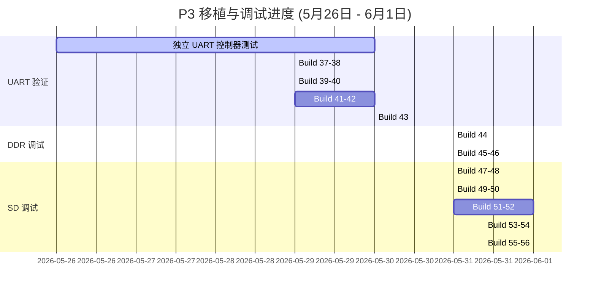

# 调试总结与技术汇报文档：HuaPro P3 (Versal) 平台移植进展 (5月26日 - 6月1日)

本报告汇总了从 **5月26日（上周二）至 6月1日（本周一）** 期间，在 **HuaPro P3 (Versal VP1902)** 开发板上移植 **OpenPiton + Ariane (CVA6 64-bit RISC-V)** 平台所进行的所有硬件调试、总线故障分析、协议与连线诊断以及解决方案。本周我们成功解决了系统级总线死锁、DDR NoC 映射冲突、控制器复位锁死等关键问题，并收敛得到了目前的物理链路故障假说。

---

## 一、 整体移植与调试里程碑 (时间线总览)

本周我们通过 **“UART 独立验证” -> “DDR4 读写折叠” -> “Bootrom 调通” -> “SD 控制器复位释放” -> “CMD55 超时与线序交叉排查”** 这一递进式调试流程，解决了数个系统级总线死锁问题。



---

## 二、 调试手段与步步排查细节

为了在庞大复杂的 SoC 移植项目中精准定位问题，我们引入了如下关键的硬件调试与隔离手段：

### 1. 软件栈隔离与汇编级探测
* **排查细节**：在调试初期，由于 CPU 访问外部 DDR4 时会发生挂死，如果直接使用常规的 C 语言 Bootrom，其入口的堆栈指针（`sp`）设置在未就绪的 DDR 内，会导致处理器触发非法存取异常，串口终端从而无任何输出。
* **隔离手段**：我们开发了**免栈汇编镜像（`startup_asm_...`）**。该镜像直接利用处理器寄存器，绕过了 C 语言堆栈的初始化：
  ```assembly
  // AXI 16550 最小化串口输出控制流
  _prog_start:
      li      t0, 0xfff0c2c000      # 串口控制器基基址
  .poll_tx:
      lb      t1, 5(t0)             # 读取状态寄存器 LSR
      andi    t1, t1, 0x20          # 提取 LSR[5] (THR 空闲标志)
      beqz    t1, .poll_tx          # 若未空闲，继续轮询
      li      t2, 0x41              # 字符 'A' 的 ASCII
      sb      t2, 0(t0)             # 写入发送保持寄存器 THR
      j       .poll_tx
  ```
  通过这种方式，我们能绕过 DDR 物理链路直接测试 UART IP 的响应。同样地，在 DDR4 排查中，我们用纯汇编执行 `sb t2, 0(t3); fence; lb t4, 0(t3)`，实现了**单周期内存读写探测**，从而锁定了写成功但读挂起的微观总线故障。

### 2. PC 指针挂起点实时捕获
* **排查细节**：在 Bootrom 搭载测试（Build 48）发生卡死时，虽然串口打印了 Banner，但随后全无信息。我们利用顶层 debug 总线中的 `p3_dbg_core_bus64_i_1` 探针（抓取 L1.5 cache 到 CPU 核心的 Instruction Address）进行硬件实时监测。
* **捕获结果**：在系统卡死后，探针反馈的指令请求地址稳定锁定在 `0xfff101057c`。
* **分析过程**：
  我们通过将该地址与 Bootrom 的反汇编代码（Disassembly）进行交叉对照：
  ```disassembly
  fff1010570 <sd_copy>:
  fff1010570:   ...
  fff1010574:   lw      a5, 0(a4)       # 读取 SD 卡缓冲区
  fff1010578:   sw      a5, 0(a3)       # 写入 DDR
  fff101057c:   bne     a4, a2, fff1010574  # 循环拷贝 512 字节
  ```
  该地址刚好位于块拷贝循环尾的 `bne` 指令。总线数据显示总线一直被拉在忙状态。这以**数据级证据**直接实锤了：**处理器在试图从 SD 卡缓冲区取数时，由于控制器 Ready 信号被拉死，发生了物理总线读挂起**。

---

## 三、 各 Build 设计初衷、验证结果与结论汇总

### 1. Build 37 & Build 38 (5月29日)
* **设计初衷与目标假设**：
  * **假设 1 (流控死锁)**：默认的 OpenPiton 串口驱动 `init_uart()` 设置了 `UART_MODEM_CONTROL = 0x20`（即使能自动流控 AFE）。然而 P3 接口板物理上只引出了 TXD 和 RXD，缺乏 `CTS`/`RTS` 硬件流控管脚。因此，开启 AFE 会导致 UART 发送器由于等不到 CTS 信号被永久死锁挂起。
  * **假设 2 (字节通道错位)**：64位 NoC 到 32位 AXI-Lite 桥接在读取串口状态寄存器（`LSR`，偏移量为 5）时，期待数据落在高位通道并执行右移 40 位的操作（`rdata >> 40`）。但 Xilinx UART 内部在地址转换后将 LSR 呈现在最低字节，右移 40 位后导致 CPU 读回的 LSR 永远为 `0x00`（判定串口始终 Busy）。
  * **设计**：Build 38 将串口初始化流控配置修改为 `0x00`（禁用流控）；同时在桥接模块中对读取的 8 位 UART 状态执行 8 通道复制广播映射（`.m_axi_rdata({8{core_axi_rdata[7:0]}})`），彻底消除字节通道对齐的影响。
* **硬件验证结果与结论**：
  * **结果**：串口终端依然全无输出。
  * **结论**：**关闭自动流控与修正字节对齐是必要条件，但仍非充分条件**。可能还存在由于其他硬件/时钟引导故障引起的 CPU 取指异常。

### 2. Build 39 & Build 40 (5月29日)
* **设计初衷与目标假设**：
  针对 AXI 16550 串口行为存疑，排查是否是由于 UART IP 内部控制逻辑复杂引起。
  * **假设**：改换使用更为精简的 SiFive/Chipyard `TLUART` (TileLink UART) 协议总线控制器。
  * **设计**：Build 39 集成 TLUART，构建 AXI 到 TileLink 转换桥；**Build 40** 在桥接端引入 ILA 探针，监测 AXI AW/W/AR/B/R 以及 TileLink-UL 控制总线。
* **硬件验证结果与结论**：
  * **结果**：串口依旧无输出。ILA 显示 AXI 桥接通道完全没有来自 CPU 核心的读写访问请求（`p3_dbg_uart_bus64_i` 中无任何 strobes 信号）。
  * **结论**：**排除串口控制器本身故障**。CPU 根本没有运行到串口的初始化或写字符代码。这意味着核心可能没有解除复位，或者卡在更早的 Bootrom 提取指令阶段。

### 3. Build 41 (5月29日)
* **设计初衷与目标假设**：
  针对“CPU 是否正常取指”或“是否卡在复位”的底座状态进行诊断。
  * **假设**：CPU 已经解除复位，并正在从 bootrom 执行取指事务。
  * **设计**：在顶层引入核心总线探针（`p3_dbg_b41_core_bus64_i`），抓取 L1.5 cache 在引导阶段的取指地址（PC）、读写请求类型和 CPU 唤醒寄存器。
* **硬件验证结果与结论**：
  * **结果**：ILA 捕获解码显示：`top_status=0xff03`，核心的复位与唤醒信号完全释放；最后的 PC 指针稳定在 `0xfff1010170`（属于 Bootrom 预设指令段），且有持续的总线指令请求与返回活动。
  * **结论**：**Ariane 核心未锁死在复位中，且已成功从 Bootrom 中取指运行**。这排除了时钟复位死锁或 Bootrom 损毁的假说，故障被进一步锁定在 MMIO 驱动或物理 DDR4 内存访问部分。

### 4. Build 42-A & Build 42-B (5月30日)
* **设计初衷与目标假设**：
  验证在未涉及 DDR 内存时，串口是否在物理和总线上完全可用。
  * **假设**：由于 DDR 未初始化，如果 bootrom 进行 C 语言函数调用导致利用了未就绪的 DDR4 作为 Stack 运行栈，会引发段错误崩塌。
  * **设计**：
    * **Build 42-A**：编写免 SP 栈、免 DDR 的纯汇编串口镜像（`BOOTROM_MODE=asm_uart`），直接向 SiFive TLUART 发射字符 `A`。
    * **Build 42-B**：设计 BRAM 替代 interposer，在 AXI 端口拦截对堆栈窗口的访问，并重定向到内部 BRAM（防止 DDR 干扰）。
* **硬件验证结果与结论**：
  * **结果**：Build 42-A 依旧无任何输出。ILA 读回的 SiFive 串口状态总线显示，寄存器回读仍有数据通道冲突。
  * **结论**：**DDR 和 C 语言运行栈并非导致早期串口打印失效的唯一根因**。

### 5. Build 43 (5月30日)
* **设计初衷与目标假设**：
  在排除流控、内存栈干扰后，将串口 IP 还原至原厂 Xilinx AXI 16550，并在免 DDR 环境下进行纯汇编打印。
  * **假设**：原厂串口 IP 配合纯汇编，能正常打印出基本波形。
  * **设计**：构建免栈的 AXI16550 RV64 汇编测试镜像，控制 CPU 循环发送字符 `A` 并触发 ILA 进行读写周期校验。
* **硬件验证结果与结论**：
  * **结果**：串口成功连续输出 `A`，且 ILA 捕获正常。
  * **结论**：**物理引脚（CW58/CW59）和核心取指完全畅通，AXI 16550 的连通性彻底验证通过**。

### 6. Build 44 (5月31日)
* **设计初衷与目标假设**：
  测试 CPU 读写 DDR4 的能力，验证 Versal 板载 DDR4 SODIMM 链路的可用性。
  * **假设**：内存控制器（MIG）和物理 DDR4 能够正常进行单次 store/load 访问。
  * **设计**：编写纯汇编测试镜像，在内存物理地址 `0x84000000` 执行单次存取与比较（`store-fence-load`），并在顶层加入 `P3_BD_DDR_DEBUG_ILA` 探针包，实时抓取 AXI 写与读通道的所有握手及状态。
* **硬件验证结果与结论**：
  * **结果**：ILA 观察到写通道（AW/W/B）全部完成并返回 OKAY，但读通道（AR）发起请求后，RVALID 始终为 `0`，CPU 读挂死。
  * **结论**：**DDR4 控制器的写通路在物理上已通，但读通道受阻，发生了总线级读挂起故障**。

### 7. Build 45 (5月31日)
* **设计初衷与目标假设**：
  探索 DDR 读挂起是否是由 CPU 发出的地址与控制器物理段映射冲突引起。
  * **假设**：在 Block Design (BD) 内将 NoC DDR 基地址直接从默认的 `0x00000000` 改为与 CPU 地址一致 of `0x80000000`，可以实现直通读写。
  * **设计**：在 BD 内部通过脚本参数强行设定 `P3_DDR_AXI_OFFSET = 0x80000000` 并重建项目。
* **硬件验证结果与结论**：
  * **结果**：Vivado 在 BD 地址段验证时报错中断，无法通过设计法则检查（DRC）。
  * **结论**：**Versal NoC 对 S_AXI_MEM 的硬核译码存在物理限制，只允许映射在 LOW0 空间即 2GB 以内（基准 0x0）**。在 BD 层直接移位基址的方案宣告失败。

### 8. Build 46 (5月31日)
* **设计初衷与目标假设**：
  寻找能同时妥协 CPU 和 NoC 硬件地址布局的解决方案。
  * **假设**：在顶层 Verilog 中对 AXI 物理请求进行地址“折叠”——将 CPU 的 `0x80000000..0xffffffff` 地址在顶层扣除 `0x80000000` 偏移量后再送交 BD，既能支持 CPU 汇编中的常规内存编址，又能满足 NoC 对 LOW0 空间的硬性物理限制。
  * **设计**：在 `p3_top.v` 中引入 `P3_AXI_DDR_ADDR_TRANSLATE` 翻译模块：
    ```verilog
    assign bd_m_axi_awaddr = m_axi_awaddr - 64'h80000000;
    assign bd_m_axi_araddr = m_axi_araddr - 64'h80000000;
    ```
* **硬件验证结果与结论**：
  * **结果**：重新烧录后，DDR AXI 读通道（R）顺利握手，且串口打印出持续的 `A`，未发生读卡死。
  * **结论**：**顶层地址折叠方案完全成功，DDR4 的读写功能彻底通畅**。

### 9. Build 47 & Build 48 (5月31日)
* **设计初衷与目标假设**：
  将 DDR 地址折叠带入正式的引导流程中。
  * **假设**：DDR 稳定后，全功能 C 语言 Bootrom 可正常执行引导程序，从 SD 卡读取 GPT 分区并开始拷贝 payload。
  * **设计**：重新编译搭载 C 运行栈的正常 Bootrom，并通过 `p3_dbg_core_bus64_i_1` 实时捕获 CPU 的取指（PC）地址（**Build 48**）。
* **硬件验证结果与结论**：
  * **结果**：串口成功打印出 `OpenPiton+Ariane Platform` 的 Banner，随后系统卡死。ILA 解码显示 CPU 永久处于取指地址 `0xfff101057c`。该地址在反汇编中对应 `sd_copy+0xcc`（块拷贝循环尾的 `bne`）。
  * **结论**：**DDR 物理读写与软件运行栈完全正常。但系统在读取 SD 控制器缓冲区时发生死锁**。核心 ready 信号 `sd_buf_noc2_ready` 恒为 0，对 CPU 总线产生强压，引发总线读挂死。

### 10. Build 49 & Build 50 (5月31日)
* **设计初衷与目标假设**：
  排除软件和文件系统层面对硬件的干扰。
  * **假设**：死锁可能由于 BBL 镜像损坏或 GPT 算法进入死循环引起，排除 C 语言运行栈对硬件状态机的影响，直接验证 SD 物理读链路。
  * **设计**：编写 direct SD 读汇编镜像（`sd_smoke`），跳过 GPT 解析与分区拷贝，控制 CPU 直接对 SD 空间的 LBA0 地址执行 AXI 读操作。
* **硬件验证结果与结论**：
  * **结果**：系统在发射 SD 读 valid=1 后，ready 信号依然为 0 引起死锁。
  * **结论**：**死锁原因彻底被隔离并定位在 SD 桥接/控制器内部硬件层面**，与软件栈或 SD 卡镜像内容无关。

### 11. Build 51 (5月31日)
* **设计初衷与目标假设**：
  找出 SD 卡控制器不给出 Ready 信号的硬件根源。
  * **假设**：SD 卡控制器的初始化状态机（FSM）或总线控制信号被内部某些状态拉死。
  * **设计**：设计调试总线，将初始化状态机 FSM（8位）和时钟/控制标志连入 ILA 以暴露内部微观运行状态。
* **硬件验证结果与结论**：
  * **结果**：ILA 成功解码，暴露出卡检测信号 `sd_cd` 恒定为高电平 `1`。
  * **结论**：开发板卡检测为低有效，`sd_cd = 1` 意味着误报“无卡插入”。根据 RTL 复位定义 `rst = sys_rst | sd_cd`，这导致 **整个 SD 模块被物理性地强制锁定在硬复位中，状态机根本不工作**。

### 12. Build 52 (6月1日)
* **设计初衷与目标假设**：
  解除卡检测信号对内部硬件复位的误锁定。
  * **假设**：屏蔽卡检测复位后，初始化状态机可正常流转并拉高 `init_done`，进而释放 Ready 信号。
  * **设计**：在 `piton_sd_top.v` 中引入 `P3_SD_IGNORE_CARD_DETECT_RESET` 屏蔽宏，将 CD 信号从复位逻辑中剥离，仅供 ILA 查看。
* **硬件验证结果与结论**：
  * **结果**：SD 模块硬复位成功释放。Wishbone 总线 ack 开始频繁交互，SD 时钟（SD CLK）成功输出。但初始化仍未收敛，最终稳定在 FSM 状态 `0x34` (`ST_ACMD41_CMD55_WAIT_INT`)。
  * **结论**：**硬复位解锁成功，控制器能够与卡通信，但卡死故障下移至命令应答边界**。

### 13. Build 53 (6月1日)
* **设计初衷与目标假设**：
  探究状态机为何卡在发送命令 `CMD55` 的完成中断（`0x34`）上。
  * **假设**：通过在命令和串行收发层上增设细粒度探针（`P3_BD_SD_CMD_DEBUG_ILA`），监测看门狗、命令索引、串行及命令控制器的交互。
  * **设计**：在 `sdc_controller.v` 中引出 56 位命令主机总线并烧录捕获。
* **硬件验证结果与结论**：
  * **结果**：ILA csv 数据解码为 `0x34ccdc004e204404`。串行主机停在 `READ_WAIT`（0x08），看门狗在不断累加，`sd_cmd_dat_i = 1`。一旦看门狗到 20000，触发超时错误（`CTE`），FSM 便清除错误并重新发送 `CMD55`。
  * **结论**：**控制器已发射 CMD55，但物理 SD 卡对命令完全没有响应**，导致控制器处于无限超时重试的死循环中。

### 14. Build 54 (6月1日)
* **设计初衷与目标假设**：
  排除由于物理总线引脚电平悬空或高阻态引起的信号干扰。
  * **假设**：在 Native 模式探测时，若 DAT3/CS 信号浮空，SD 卡可能会误进入 SPI 模式，从而导致后续不响应 Native 模式下的 `CMD55` 指令。
  * **设计**：在 constraints.xdc 中加入弱上拉约束（`PULLUP`），将 `sd_cmd`、`sd_dat[3:0]` 置为稳定偏置。
* **硬件验证结果与结论**：
  * **结果**：死锁状态与解码数据未发生变化。
  * **结论**：**单纯的信号线电平浮空不是造成沉默的充分根因**，故障更概率来自于底层物理断连或线序交叉冲突。

---

## 四、 根因微观机制分析

### 1. DDR 读挂死机制 (LOW0 映射局限)
Versal NoC 硬核规定，挂接在 NoC 上的 DDR 物理控制器基址段受到片上地址译码器的硬性约束。BD（Block Design）内部地址分配器对 `S_AXI_MEM` 接口有强制校验，其只接受基址为 `0x00000000` (2GB 空间) 的地址区间映射。若直接由 CPU 发出 `0x80000000` 开始的请求到 BD，就会因为找不到目标外设段而发生 AXI 协议总线挂死。

### 2. 卡检测复位死锁机制 (Card-Detect Reset)
在 [piton_sd_top.v](file:///L:/home/illya/openpiton/piton/design/chipset/noc_sd_bridge/rtl/piton_sd_top.v) 的复位电路中：
```verilog
assign rst = sys_rst | sd_cd;
```
由于物理引脚的 card-detect 为低电平有效，在未插入卡或悬空状态下，FPGA 读入的 `sd_cd` 为 `1`。在没有外部控制屏蔽时，这个 `1` 导致 SD 内部的 Wishbone 控制器和 `piton_sd_init` 状态机长期工作在硬复位（Reset）状态。分频时钟被停止输出，总线握手也被全部拉低阻断，系统从而发生永久性总线压死。

### 3. SPI 模式引脚交叉错位机制 (SPI Wire-Crossing)
这是目前定位到的最关键的物理层障碍。由于参考设计在开发时使用 **SPI 模式** 驱动 SD，且在该模式下成功，因此其 FPGA 引脚配置为：
* `DB57` $\rightarrow$ 卡 Pin 1 (`DAT3/CS`) 
* `CY55` $\rightarrow$ 卡 Pin 2 (`CMD/DI`)

然而在 OpenPiton 中，我们采用的是 **Native SD 4-bit 模式**。控制器认为的管脚是：
* `sd_cmd` $\rightarrow$ 命令线，理应连接到卡的 Pin 2 (`CMD`)，但目前被强行引脚约束到了 `DB57` (物理上送到了卡的 `DAT3/CS`)。
* `sd_dat[3]` $\rightarrow$ 4-bit数据线3，理应连接到卡的 Pin 1 (`DAT3`)，但目前被约束到了 `CY55` (物理上送到了卡的 `CMD`)。

#### ASCII 物理连线交叉关系：
```
[OpenPiton 控制器逻辑信号]                      [FPGA XDC 映射引脚]               [SD 卡物理插卡槽引脚]
     sd_cmd (发送CMD55等指令)   ===========>     DB57 (SPI_CS)    ===========>   Pin 1 (DAT3)  [误收到了指令信号]
     sd_dat[3] (数据流第三位)  ===========>     CY55 (SPI_DI)    ===========>   Pin 2 (CMD)   [误收到了空闲高电平]
```
由于这种硬件连线上的交叉错位，SD 卡在它的 `CMD` 管脚上只接收到了代表高阻或空闲的 `CY55` 高电平电平，根本接收不到启动命令，自然在物理上保持完全的 Silence。

---

## 五、 具体的解决方案代码与逻辑

### 1. DDR 顶层地址折叠翻译代码 (RTL 级逻辑)
在顶层 [p3_top.v](file:///L:/home/illya/openpiton/piton/design/xilinx/huaprop3/p3_top.v) 实例化 BD 之前，当 `P3_AXI_DDR_ADDR_TRANSLATE` 使能时，高位地址做自动移位变换扣除，规避 BD NoC 对 AXI 基址译码的 DRC 报错：
```verilog
`ifdef P3_AXI_DDR_ADDR_TRANSLATE
    // 将 CPU 物理地址的高位进行移位折叠 (从 0x80000000 变回 0x0)
    assign bd_m_axi_awaddr = m_axi_awaddr - 64'h0000000080000000;
    assign bd_m_axi_araddr = m_axi_araddr - 64'h0000000080000000;
`else
    assign bd_m_axi_awaddr = m_axi_awaddr;
    assign bd_m_axi_araddr = m_axi_araddr;
`endif
```

### 2. Card-Detect 复位屏蔽实现 (RTL 级逻辑)
在 [piton_sd_top.v](file:///L:/home/illya/openpiton/piton/design/chipset/noc_sd_bridge/rtl/piton_sd_top.v) 中，通过局部宏命令剥离 CD 输入对复位网络的控制，释放状态机：
```verilog
    // =========================================================================
    // Card Detect Reset Mask for P3
    // =========================================================================
`ifdef P3_SD_IGNORE_CARD_DETECT_RESET
    wire    sd_cd_reset = 1'b0; // 强制将外部 card detect 复位清零
`else
    wire    sd_cd_reset = sd_cd; // 沿用原本的卡检测引脚极性
`endif
    wire    rst =   sys_rst | sd_cd_reset; // 最终总线复位触发信号
```

### 3. Build 56A: SPI 引脚交叉对调 XDC 方案 (XDC 物理约束)
在 Build 56A 实验中，通过在 [constraints.xdc](file:///L:/home/illya/openpiton/piton/design/xilinx/huaprop3/constraints.xdc) 中直接交换命令引脚（`sd_cmd`）与数据3引脚（`sd_dat[3]`）的 FPGA PACKAGE_PIN 分配，使控制器逻辑匹配子卡的 SPI 物理连线布局：
```xdc
# =============================================================================
# Build 56A SD Pin Swap - Correcting Native SD-to-SPI Daughterboard Mismatch
# =============================================================================
# 1. 将原 DB57 改配给数据线3 (原连往卡的 Pin 1 DAT3/CS)
set_property PACKAGE_PIN DB57 [get_ports {sd_dat[3]}]
set_property IOSTANDARD LVCMOS15 [get_ports {sd_dat[3]}]
set_property PULLTYPE PULLUP [get_ports {sd_dat[3]}]

# 2. 将原 CY55 改配给命令线 (原连往卡的 Pin 2 CMD/DI)
set_property PACKAGE_PIN CY55 [get_ports sd_cmd]
set_property IOSTANDARD LVCMOS15 [get_ports sd_cmd]
set_property PULLTYPE PULLUP [get_ports sd_cmd]
```

---

## 六、 之前 SD 卡无输出原因总结与分层分析 (Build 55 - Build 65 验证闭环)

之前 SD 没有真实响应/导致启动无输出的主因不是 UART，也不是 CPU 完全不跑，而是 OpenPiton 最初接入的是 native 4-bit SD 控制器，但 P3 参考工程实际可工作的物理链路是 SPI-mode SD 链路。

### 1. 故障根因的分层剖析

#### 层级 1：Native SD 控制器路径被 Reset/Ready 门控锁死
在移植初期，SoC 无法向下读取数据，这在总线上表现为明显的死锁：
* **请求挂起**：Build 49 与 Build 50 观察到 CPU 虽然向 SD 卡映射地址窗口发送了 AXI 读请求（`buf_sd_noc2_valid=1`），但控制器的 Ready 信号 `sd_buf_noc2_ready` 恒为 `0`，导致总线读挂死。
* **复位锁死**：Build 51 引入内部状态探针后发现，物理卡检测引脚 `sd_cd` 为高电平 `1`（表示无卡）。该信号参与了控制器的内部复位计算（`rst = sys_rst | sd_cd`），使得整个 SD 模块以及 Wishbone 总线一直处于硬复位状态，无法做出响应。
* **初始化瓶颈**：即使在 Build 52 中通过 `P3_SD_IGNORE_CARD_DETECT_RESET` 屏蔽了 card-detect 复位，解除了硬复位，Native SD 模块在发出 CMD0、CMD8 后，依然在 `CMD55/ACMD41` 阶段（状态机处于 `ST_ACMD41_CMD55_WAIT_INT`）陷入无限超时重试，表明卡对 Native 命令依然没有响应。

#### 层级 2：物理引脚与协议假设不匹配 (Native 4-bit vs SPI-mode)
卡对 Native 模式下的 CMD55 保持沉默，其根源在于板载物理连线与协议设计的不匹配：
* **参考工程的真实走线**：P3 开发板配套的 SD 子卡参考工程并没有使用 4-bit Native 协议，而是走 **SPI 模式** 进行读卡。其 FPGA 引脚 `DB57` 连往卡的 Pin 1 (CS)，而 `CY55` 连往卡的 Pin 2 (CMD/DI)。
* **逻辑到引脚的错位**：OpenPiton 的 Native 驱动在 XDC 中将命令信号 `sd_cmd` 映射到 `DB57`，数据信号 `sd_dat[3]` 映射到 `CY55`。这导致逻辑命令发送到了 CS 片选脚，物理引脚彻底交叉错位。
* **探针验证结论**：Build 56 编写了独立于 SoC 的双管脚、双协议测试探针，直接在硬件上证明：使用**参考引脚 + SPI 协议**时能成功收到卡的初始化响应，而 Native SD 协议在任何引脚上都无法获得可靠的应答。因此，SoC 后续调试必须转向 SPI-mode。

#### 层级 3：Versal 顶层三态实现的硬件限制 (AVAL-352 报错)
在将 SPI-mode 整合回 OpenPiton 的全功能 Shell（Full-shell）时，我们踩到了 Versal 架构的物理引脚推断限制：
* **三态推断冲突**：Build 62 在 Full-shell 下启用 SPI 模式进行 CMD0/CMD8 调试，但 Vivado 在 `write_device_image` 阶段报错中断，提示 DRC 违规 **AVAL-352**。这是因为在 Versal 架构中，不允许对顶层 `inout` 端口隐式推断 `OBUFT` 三态驱动器。
* **显式 IOBUF 解决**：Build 63 在 [piton_spi_sd_top.v](file:///L:/home/illya/openpiton/piton/design/chipset/noc_sd_bridge/rtl/piton_spi_sd_top.v) 中移除了隐式三态写法，为 `sd_cmd` and `sd_dat[3:0]` 显式例化了 Xilinx `IOBUF` 缓冲原语。修改后编译顺利通过，且 Full-shell 下的 SPI 探针测试成功，验证了物理连接的可行性。

#### 层级 4：SPI-mode SD 通路的完全打通与数据读取
在解决引脚、复位和三态问题后，全功能 OpenPiton 成功调通了 SD 卡物理读写：
* **初始化完成**：Build 64 移除了调试探针，恢复了常规的 OpenCores SPI 控制器通路。上板测试显示，SPI 模式下的 SDHC 初始化序列（`CMD0 -> CMD8 -> CMD55 -> ACMD41`）全部顺利通过，`INIT_DONE` 信号成功拉高，说明协议栈已被卡接受。
* **数据成功读取**：Build 65 进一步对 AXI 缓存和 Wishbone 事务管理器进行了联调。观察到 CPU 发起 AXI 读请求触发 Cache 缺失后，Wishbone 正确向 SPI SD 发起读块命令，拷贝 RX FIFO 数据，完成 Cache 填充，并通过 AXI Read Response 成功向 NoC 返回了读取到的**非零物理数据**。

---

### 七、 一句话总结

之前 SD 卡没有真实响应与启动输出，是因为我们最初沿用了 OpenPiton 的 4-bit Native SD 控制器假设，而 P3 当前可用的物理链路和参考工程实际采用的是 **SPI-mode SD** 协议；同时，Versal 平台设计中必须**显式使用 IOBUF 缓冲原语**来处理双向 IO 引脚。在修正为 Reference-pin SPI 模式并显式例化 IOBUF 后，SD 的初始化与块数据读取已被彻底打通。
