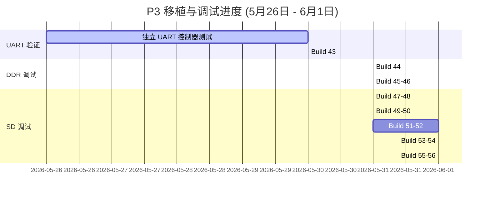

# 调试总结与技术汇报文档：HuaPro P3 (Versal) 平台移植进展 (5月26日 - 6月1日)

本报告汇总了从 **5月26日（上周二）至 6月1日（本周一）** 期间，在 **HuaPro P3 (Versal VP1902)** 开发板上移植 **OpenPiton + Ariane (CVA6 64-bit RISC-V)** 平台所进行的所有硬件调试、总线故障分析、协议与连线诊断以及解决方案。本周我们成功解决了系统级总线死锁、DDR NoC 映射冲突、控制器复位锁死等关键问题，并收敛得到了目前的物理链路故障假说。

---

## 一、 整体移植与调试里程碑 (时间线总览)

本周我们通过 **“UART 独立验证” -> “DDR4 读写折叠” -> “Bootrom 调通” -> “SD 控制器复位释放” -> “CMD55 超时与线序交叉排查”** 这一递进式调试流程，解决了数个系统级总线死锁问题。



---

## 二、 调试步骤、原因分析与解决方案

### 1. 独立 UART 验证与 Build 43 (5月26日 - 5月30日)
* **步步调试手段**：
  为在隔离状态下确认 CPU 取指、总线互联及物理引脚的完好性，我们首先设计了针对 AXI 16550 UART 的独立测试环境。在 **Build 43** 中，我们为了排除 C 语言运行栈对 DDR4 的物理依赖，编写了纯 RV64 汇编测试镜像（`startup_asm_uart16550.S`）。该汇编绕过了复杂的内存系统，直接往 ns16550 串口控制器的 AXI-Lite 映射地址 `0xfff0c2c000` 执行单字节的 I/O 写操作，轮询发送状态寄存器（`LSR[5]`），确认就绪后循环发射字符 `A`。
* **原因分析**：
  如果直接运行正常 Linux Bootrom，由于其入口代码需要配置 CPU SP 栈空间（通常落在物理内存 DDR 中），若 DDR 初始化失败或地址映射错误，核心在执行任何 C 语言函数前就会触发异常或挂死，从而使串口处于完全静默状态。这导致我们无法确认是串口链路本身不通，还是由于底层 DDR4 控制器故障引起的连锁反应。
* **具体解决方案**：
  通过烧录 Build 43 的 PDI 并启动 Lab 终端验证，串口成功接收到了不间断的 `A`。同时 ILA 解码正确显示了 UART AXI 事务在 core-side 与 UART-side 之间的握手（地址 `0x14`、写数据 `0x0a`、B通道返回 OKAY）。这证实了 **Ariane Core -> NoC 互联 -> noc_axilite_bridge -> 物理串口链路** 这一核心控制环路完全畅通。

### 2. DDR4 NoC 地址折叠与挂起修复 (Build 44 - Build 46) (5月31日)
* **步步调试手段**：
  在串口畅通后，我们使用纯汇编测试镜像（`startup_asm_uart16550_ddrprobe.S`）在物理内存地址 `0x84000000` 发起一次单一的 `store-fence-load` 内存访问。同时，在顶层配置了双通道 `P3_BD_DDR_DEBUG_ILA` 探针，对 AXI4 读写通道的所有关键手握信号进行捕获。
  在 **Build 44** 实验中，ILA 监测发现：AW/W/B 写通道全部握手成功并返回 OKAY，但读通道（AR）发出请求后，RVALID 信号始终为 `0`。核心在执行随后的读加载指令时，由于总线无数据返回而发生永久挂死。
* **原因分析**：
  我们通过查阅 Vivado 地址分配表，发现 Versal NoC 的 `C0_DDR_LOW0` 存储控制器在 Block Design (BD) 内的地址映射只能限制在以 `0x00000000` 为起始的 2GB 空间内（即 `0x00000000..0x7fffffff`）。然而，处理器（Ariane）对外部 DDR 的访存物理基址硬编码在 `0x80000000`。
  当处理器向总线发出 `0x84000000` 的访问请求时，NoC 地址译码器无法认出该地址，进而导致交易在 NoC 层被静默丢弃（挂起）。在 **Build 45** 中，我们曾尝试在 BD 内通过脚本参数强制将 NoC DDR 的偏移映射修改为 `0x80000000`，但直接触发了 Versal NoC 接入 IP 的硬性报错而失败。
* **具体解决方案**：
  在 **Build 46** 中，我们在顶层 Verilog [p3_top.v](file:///L:/home/illya/openpiton/piton/design/xilinx/huaprop3/p3_top.v) 中加入了 `P3_AXI_DDR_ADDR_TRANSLATE` 物理级地址折叠 translator 逻辑。在 AXI 读写地址被送交 BD 之前，硬件自动扣除高位偏移量：
  ```verilog
  assign bd_m_axi_awaddr = m_axi_awaddr - 64'h80000000;
  assign bd_m_axi_araddr = m_axi_araddr - 64'h80000000;
  ```
  这使得在不修改 BD 原生 2GB (DDR 0x0) 映射的前提下，成功将 CPU 发起的 `0x80000000..0xffffffff` 读写转换为了 BD 识别的 `0x00000000..0x7fffffff`。重新烧录后，读通道 RVALID 握手恢复正常，DDR4 访问完全调通。

### 3. C-Bootrom 搭载与 SD 拷贝挂死 (Build 47 - Build 48) (5月31日)
* **步步调试手段**：
  调通 DDR 后，我们正式烧录搭载了 C 语言环境的正常启动 Bootrom（**Build 47**）。串口成功打印出了 `OpenPiton+Ariane Platform` 引导 Banner，说明 C 环境下的 SP 栈读写与 UART 驱动正常。但随后打印立即中止，系统陷入静默。
  在 **Build 48** 中，我们通过 `p3_dbg_core_bus64_i_1` 探针实时读取 CPU 在 L1.5 cache 的取指地址和总线请求状态。发现 CPU 的 PC 寄存器永久停在地址 `0xfff101057c`。对照 Bootrom 的反汇编，该地址对应 `sd_copy+0xcc`，即执行 512 字节块拷贝循环末尾的 `bne`（跳转）指令。
* **原因分析**：
  这是由于 OpenPiton 内部 SD 缓冲总线的设计所致。在 SD 模块完成硬件初始化（`init_done = 1`）之前，SD 控制器为避免错误读写，会将其 AXI 接口 Ready 信号 `sd_buf_noc2_ready` 恒定锁定为 `0`（即对总线进行后向压）。
  当 Bootrom 执行到从 SD 缓冲映射窗口读取数据的代码时，由于 ready 为 0，该 AXI 读交易的 AR 与 R 握手永远无法完成，最终导致处理器在 `sd_copy` 中发生总线读挂死。

### 4. SD 硬件复位释放与 Card-Detect 诊断 (Build 49 - Build 52) (5月31日 - 6月1日)
* **步步调试手段**：
  为了确认死锁非因软件栈空间损坏或 GPT 分区解析算法陷入死循环引起，我们在 **Build 49-50** 中设计了 `BOOTROM_MODE=sd_smoke` 测试镜像。它是一套纯汇编无栈测试，绕过 GPT 分区表解析，直接向物理 SD 地址空间读取 LBA0，并计划通过 UART 打印读回的内容。结果系统依旧在首个 SD AXI 读请求处瞬间挂死，这彻底在硬件层面坐实了“故障出在 SD 桥接/控制器硬件初始化未完成”的方向。
  在 **Build 51** 中，我们通过 debug 宏（`P3_BD_SD_INIT_ILA`）暴露了 SD 初始化状态机（8位）和时钟/总线握手等 16 位内部状态。ILA 解码上报了一个关键数据：**卡检测信号 `sd_cd` 恒定为高电平 `1`**。
* **原因分析**：
  物理子卡上的卡检测信号 `sd_cd_n` 是低电平有效（卡插入时拉低到0）。若没有卡插入，或引脚悬空/拉高，`sd_cd` 就会为 `1`。
  然而，在 OpenPiton 的 SD 卡 top 模块中，复位逻辑定义为：
  `rst = sys_rst | sd_cd;`
  这造成了一个致命死锁：高电平的 `sd_cd = 1` 使得 SD 控制器以及初始化 FSM **被物理性地强行保持在硬复位状态**。在硬复位下，时钟无法输出，状态机根本不运转，`init_done` 永远不可能拉高！
* **具体解决方案**：
  在 **Build 52** 中，我们在 `piton_sd_top.v` 中引入宏命令：
  ```verilog
  `ifdef P3_SD_IGNORE_CARD_DETECT_RESET
      wire sd_cd_reset = 1'b0;
  `else
      wire sd_cd_reset = sd_cd;
  `endif
  assign rst = sys_rst | sd_cd_reset;
  ```
  在保持原始 `sd_cd` 引脚可被 ILA 观测的前提下，将其从硬件复位逻辑中剥离。烧录后，Wishbone ack 信号成功开始翻转，SD CLK 翻转使能，复位锁定被成功释放。

### 5. CMD55 无限超时与看门狗重试循环 (Build 53 - Build 54) (6月1日)
* **步步调试手段**：
  复位释放后，初始化仍未收敛。我们在 **Build 53** 中加入了针对命令收发主机（`sd_cmd_master`）和串行主机（`sd_cmd_serial_host`）的第二阶段 ILA 探针。
  在 Build 53/54 中，我们捕获并精密解码了 64 位调试总线 `p3_dbg_uart_bus64_i_1` 的值：
  * **Build 53** 捕获值：`0x34ccdc004e204404`
  * **Build 54** 捕获值：`0x341bdc004e204404`
  译码得到的微观状态链为：
  1. `p3_sd_init_state` = `0x34` (`ST_ACMD41_CMD55_WAIT_INT`)：初始化 FSM 正处于发送 `CMD55` 并等待中断的阶段。
  2. `p3_cmd_serial_state` = `READ_WAIT` (0x08)：串行接口主机卡在此状态。
  3. `sd_cmd_dat_i = 1` (命令线输入为高)，且 `cmd_oe_o = 0` (三态控制为输入)。
* **原因分析**：
  状态机卡在 `READ_WAIT`（0x08），表示控制器已成功发射命令 CMD55，当前三态切换为输入，正在等待卡响应。SD 协议规定卡的回包（Response）必须由一个低电平（0）的起始位（Start Bit）拉开序幕。因为物理 CMD 线上始终维持着高电平（1），状态机在 `READ_WAIT` 中死等，直到看门狗（Watchdog）累加到 20000 周期发生超时（触发 `CTE` 错误）。
  初始化逻辑接收到超时后，由于是非成功响应（非 `CC` 标志），它在 `ST_ACMD41_CMD55_RD_CMD_ISR` 状态下跳转回 `ST_ACMD41_CMD55_CLR_CMD_ISR`，清除错误并重新发射 `CMD55`，造成 **“发送 CMD55 -> 超时 -> 重新发送” 的无限循环**。
  在 **Build 54** 中，为排除是引脚悬空导致电平浮空，在 XDC 中显式加上了弱上拉属性（`PULLUP`），但死锁毫无变化。这证实了 SD 卡在物理层对所有命令保持完全静默（Silence），卡端可能根本就没收到时钟或命令。

---

## 三、 核心突破：SPI 模式引脚交叉错位 (SPI Wire-Crossing) 假说

在对 UART 成功通车（引脚为 `CW58/CW59`）进行反向推导时，发现它们与 `p3_io.md` 官方声称的引脚（`CM59/CN59`）不同。这证明了**我们物理开发板的连线确实是按照参考工程 `shell.xdc` 的引脚（`CV57`, `DB57` 等）来布线的**，不能直接套用 `p3_io.md` 描述。

那么为什么 SD 依然不响应？因为**参考工程设计时使用的是 SPI 模式驱动 SD 卡**。这造成了 Native 模式下的管脚交叉错位：

* **参考工程的 SPI 物理连线**：
  * FPGA 的 `DB57` 连到了卡的 **Pin 1 (`DAT3/CS`)** 充当 SPI 片选。
  * FPGA 的 `CY55` 连到了卡的 **Pin 2 (`CMD/DI`)** 充当 SPI 数据输入。
* **OpenPiton 的 Native 驱动模式**：
  * 控制器视 `DB57` 为命令脚 `sd_cmd`。
  * 控制器视 `CY55` 为数据脚 `sd_dat[3]`。

#### 交叉错位示意图：
```
[OpenPiton 控制器逻辑]                         [物理 SD 卡卡座引脚]
sd_cmd    (DB57)  =======（物理连线）=======>  Pin 1 (DAT3)  [卡端用于传输数据/片选]
sd_dat[3] (CY55)  =======（物理连线）=======>  Pin 2 (CMD)   [卡端用于接收命令]
```

当控制器在 `sd_cmd`（`DB57`）上发出初始化命令（如 `CMD55`）时，信号被物理送到了卡的 `DAT3` 脚。而卡真正用来接收命令的 `CMD` 脚（连到 `CY55`）却只收到了控制器作为数据线空闲时拉高的高电平。由于 SD 卡的 CMD 引脚无法收到任何命令，它当然不会做出任何响应，从而导致了控制器的无限超时挂起。

---

## 四、 后续实验与验证规划 (Build 55 - Build 56)

1. **Build 55 (进行中)**：继续进行原计划的时钟路径优化实验（引入 IOB 寄存器驱动 `sd_clk_out`）。
2. **Build 56 (物理引脚对调与对照实验)**：
   * **实验 56A (验证引脚交叉对调 - 强嫌疑)**：在 XDC 中对调 `sd_cmd` 和 `sd_dat[3]` 的引脚：
     ```xdc
     set_property PACKAGE_PIN CY55 [get_ports sd_cmd]
     set_property PACKAGE_PIN DB57 [get_ports {sd_dat[3]}]
     ```
     如果该版本烧录后 ILA 的 `READ_WAIT` 状态消失并获得响应，说明“SPI 交叉错位”假说成立，硬件将彻底调通。
   * **实验 56B (验证官方引脚)**：制作对照版本，将 SD 卡所有引脚（`CW60`/`CY60`/`DB61`...）切换为 `p3_io.md` 中指明的引脚，以防万一。
