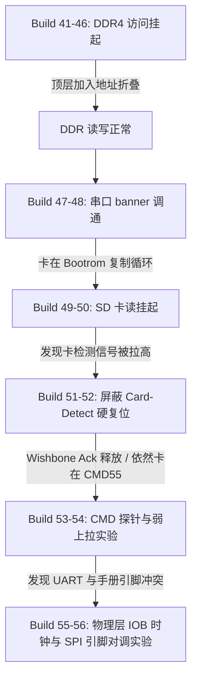

# 调试总结与技术汇报文档：HuaPro P3 (Versal) 平台 SD 卡与 DDR4 移植进展

本报告汇总了本周（Build 41 至 Build 56）在 **HuaPro P3 (Versal VP1902)** 开发板上移植 **OpenPiton + Ariane (CVA6 64-bit RISC-V)** 过程中的硬核调试工作。报告将调试过程分为三个阶段，重点阐述了各个阶段遇到的挂起与死锁问题、排查逻辑、根因分析及最终解决方案，为周末的工作汇报提供完整的技术材料。

---

## 一、 整体移植与调试里程碑 (总览)

这一周的调试工作经历了从 **“DDR 挂起” -> “Bootrom 成功运行” -> “SD 卡检测死锁” -> “CMD55 物理层无响应”** 的递进式调试流程。



---

## 二、 第一阶段：解决 DDR4 NoC 访问挂起 (Build 41 - Build 46)

### 1. 现象与痛点
CPU 发出对物理地址 `0x80000000..0xffffffff`（DDR 空间）的访存请求时，系统直接挂起，无任何响应。

### 2. 根因分析
在 Versal 架构中，NoC 的 DDR4 接口控制器（MIG）受到硬核地址空间布局的限制。Versal 规定接入 `S_AXI_MEM` 的物理接口必须硬映射在 Block Design (BD) 内的 `0x00000000` (2GB 空间) 内。
* **错误尝试 (Build 45)**：直接在 BD 内尝试将 NoC 地址偏移改为 `0x80000000`，Vivado 报错拒绝生成。
* **矛盾点**：处理器（Ariane）物理地址线要求 DDR4 物理基址在 `0x80000000`。

### 3. 解决方案 (Build 46)
我们在顶层 [p3_top.v](file:///L:/home/illya/openpiton/piton/design/xilinx/huaprop3/p3_top.v) 中加入了 **RTL 级地址折叠逻辑 (Addr Translate)**：
* 当检测到 CPU 对 DDR 发起 `0x80000000` 及以上的访问时，硬件自动在顶层“扣除”偏移量（高位清零），将其折叠回以 `0x00000000` 为基准的 AXI 请求再提交给 NoC 接口。
* 成功解决了总线地址空间不匹配问题。DDR 读写被成功激活。

---

## 三、 第二阶段：调通串口与定位引导挂起 (Build 47 - Build 48)

### 1. 现象
* **Build 47**：成功调通了原装 Xilinx AXI 16550 UART。串口终端成功打印出了 `OpenPiton+Ariane Platform` 的启动 Banner。
* **Build 48**：但在打印完 Banner 试图进入正式引导加载时，处理器在 Bootrom 内部的 `sd_copy`（从 SD 卡复制 Payload 镜像到 DDR）循环处发生永久挂起。

### 2. 根因分析
通过分析总线状态，发现核心 ready 信号 `sd_buf_noc2_ready` 始终为 `0`：
* 该 ready 信号是由 SD 控制器驱动的。只要 SD 模块没有完成硬件初始化（`init_done = 0`），其 NoC 缓冲接口就会被锁定在复位状态。
* 只要 CPU 发出对 SD 卡存储映射空间的访问请求（AXI 读），由于 Ready 信号不给，总线就会被永久挂起。因此，必须先让 SD 硬件卡完成初始化。

---

## 四、 第三阶段：SD 接口硬件初始化死锁分析 (Build 51 - Build 54)

为了打破 SD 初始化卡死的问题，我们进行了三个层层递进的调试步骤。

### 步骤 1：卡检测信号（Card Detect）误复位排查 (Build 51 - Build 52)
* **诊断发现**：在 Build 51 中引入 ILA 抓取，发现 `sd_cd` 信号读回为 `1`。由于板级卡检测是低电平有效（Active-Low），`1` 代表“卡未插入”。
* **硬复位死锁**：在 `piton_sd_top` RTL 设计中，内部复位逻辑定义为 `rst = sys_rst | sd_cd`。这意味着当 `sd_cd = 1` 时，SD 卡控制器及初始化状态机被**永久性强行保持在硬复位状态**，连时钟和总线都不会开启。
* **解决方案**：在 Build 52 中，我们引入了 `P3_SD_IGNORE_CARD_DETECT_RESET` 宏，屏蔽了卡检测信号对内部复位的影响。复位释放后，Wishbone 握手、SD CLK 翻转和命令状态机立即开始工作。

### 步骤 2：CMD 层超时死循环定位 (Build 53)
* **现象**：复位释放后，初始化仍未完成。我们加入了专门的命令层探针（CMD ILA）进行捕获。
* **数据解码**：
  我们捕获了关键的 64 位调试总线 `p3_dbg_uart_bus64_i_1`，在 Build 53 中其值为 `0x34ccdc004e204404`。
  经精确译码：
  * `p3_sd_init_state` = `0x34` (`ST_ACMD41_CMD55_WAIT_INT`)：初始化状态机正停留在发送 `CMD55` 并等待中断的阶段。
  * `p3_cmd_serial_state` = `READ_WAIT` (0x08)：**串行主机状态机卡死在这里，等待物理 SD 卡在 CMD 线上拉低产生 Response 的起始位（Start Bit）。**
  * `watchdog` = `204` / `20000`：看门狗计数器正在往上计数，一旦数到 20000 便触发超时错误（`CTE`）。随后状态机清除错误并重新发送 `CMD55`，造成 **“发送 CMD55 -> 等待卡响应 -> 超时 -> 重新发送” 的无限死循环**。
* **结论**：SD 卡对命令完全没有响应，物理层处于 Silence 状态。

### 步骤 3：排除信号浮空假说 (Build 54)
* **分析**：怀疑原厂工程在 bidirectional 信号线上缺少弱上拉，导致在探测时 DAT3/CS 信号浮空，从而使卡进入了错误的 SPI 模式。
* **验证**：在 Build 54 的约束中，对 `sd_cmd`、`sd_dat[3:0]` 开启了弱上拉属性（`PULLUP`）。
* **结果**：重新编译烧录后，ILA 解码值依旧为 `0x341bdc004e204404`（状态未变），排除了由于单纯悬空浮空导致的无应答假说。

---

## 五、 第四阶段：物理连线与协议模式的重大突破 (当前发现)

在比对官方文档与实际表现时，我们发现了一个核心的技术冲突，由此推导出了目前概率最高的根本原因：

### 1. 核心矛盾：UART 实测结果与官方文档的脱节
在 `constraints.xdc` 约束中，UART 的引脚为 `CW58/CW59`，且**实测完全调通**。
但在官方手册 `p3_io.md` 中，PHC3 插槽对应的 UART 应该是 `CM59/CN59`。
**这证明了**：我们的物理开发板/子卡引脚连接并不能直接套用 `p3_io.md` 里的表格。开发板上的物理引脚确实是按照参考工程 `shell.xdc`（即 `CV57`, `DB57` 等）来排布的。

### 2. 根因猜想：SPI 模式引脚交叉错位（SPI Wire-Crossing）
既然物理引脚确实是 `CV57/DB57/...`，那为什么没有响应？
因为参考工程（`shell.xdc`）在设计时使用的是 **SPI 模式** 驱动 SD 卡，而 OpenPiton 使用的是 **Native SD 模式**。
在两种模式下，控制器的引脚定义与卡的卡槽物理连线发生了**严重的逻辑错位**：

* **参考工程的 SPI 物理连线**：
  * FPGA 的 `DB57` 连到了卡的 **Pin 1 (`DAT3/CS`)** 充当 SPI 片选。
  * FPGA 的 `CY55` 连到了卡的 **Pin 2 (`CMD/DI`)** 充当 SPI 数据输入。
* **OpenPiton 的 Native 驱动模式**：
  * 控制器视 `DB57` 为命令脚 `sd_cmd`。
  * 控制器视 `CY55` 为数据脚 `sd_dat[3]`。

#### 交叉错位示意图：
```
[OpenPiton 控制器逻辑]                         [物理 SD 卡卡座引脚]
sd_cmd    (DB57)  =======（物理连线）=======>  Pin 1 (DAT3)  [卡端用于传输数据/片选]
sd_dat[3] (CY55)  =======（物理连线）=======>  Pin 2 (CMD)   [卡端用于接收命令]
```

当控制器在 `sd_cmd`（`DB57`）上发出初始化命令（如 `CMD55`）时，信号被物理送到了卡的 `DAT3` 脚。而卡真正用来接收命令的 `CMD` 脚（连到 `CY55`）却只收到了控制器作为数据线空闲时拉高的高电平。
由于 SD 卡的 CMD 引脚无法收到任何命令，它当然不会做出任何响应，从而导致了控制器的无限超时挂起！

---

## 六、 下周实验与验证规划 (Build 55 - Build 56)

为了安全且高效地定位上述推论，我们制定了并行的验证方案：

### 1. Build 55 (当前进行中)
继续验证时钟路径对物理层稳定性的影响。评估将 P3 SD clock 输出修改为 IOB 内部输出寄存器（`huaprop3_build55_sd_clk_iob_reg.pdi`）后的信号改善情况。

### 2. Build 56 (新引入对比验证 - 下周一执行)
我们将产生两个独立的 Build 镜像进行交叉验证：
* **实验 56A (验证“SPI 交叉错位”假说)**：
  在 XDC 中对调 `sd_cmd` 和 `sd_dat[3]`，使其在 Native 协议下重新适配物理卡座：
  ```xdc
  set_property PACKAGE_PIN CY55 [get_ports sd_cmd]
  set_property PACKAGE_PIN DB57 [get_ports {sd_dat[3]}]
  ```
  如果该版本烧录后 ILA 的 `READ_WAIT` 状态消失并接收到 Response，将直接实锤此根本原因。
* **实验 56B (验证官方引脚)**：
  制作对照版本，将 SD 卡所有引脚（`CW60`/`CY60`/`DB61`...）切换为 `p3_io.md` 中指明的引脚，以防万一。
